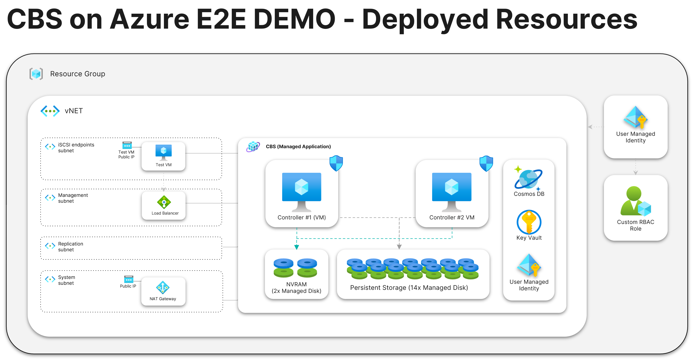

# Bicep Framework for deploying CBS on Azure

The Bicep framework for CBS deployment comes with Bicep templates and bash scripts, combined from following modules:

- **Module #01 (Prerequisites)** -  this module deploys all the resources required for CBS deployment, including Virtual Network, User-Managed Identity, Custom Role, and others.
 
- **Module #02 (CBS Managed App)** - this module deploys the CBS Managed App itself into the environment with all prerequisites met.
 
- **Module #03 (Test VM)** -  This module provisions a test Virtual Machine (VM) of Windows Server 2019 with pre-installed MS SQL server and configures test volumes in CBS instance to mount them via iSCSI protocol.
 
- **Module #04 (E2E Demo Deployment) 🧪** - For hands-on/testing purposes, this module combines all modules #01-#03 (described above) and deploys all required resources, CBS Managed App and a test Virtual Machine in the single deployment script.

## Prerequisites
- bash
- Docker or Windows (**WSL recommended**) / Linux<sup>[1]</sup> / MacOS<sup>[2]</sup>
- `az-cli`, `bicep-cli`, `jq` (all should get installed with setup-machine script or included in the Dockerfile)

<small><sup>[1],[2]</sup> these OS are not fully tested, please report any issue you find</small>

## Installation

You can also run all commands in this repo on your computer or in container using the prepared Dockerfile in the repo.


### In Docker container

1. Build the container image with command:
    ```bash
    $ docker build . -t cbs-bicep
    ```
1. Run the container:
    ```bash
    $ docker run -v .:/data -it cbs-bicep
    ```
1. Follow instructions on screen to authenticate into Azure CLI via device code login method.

<br>
<i>or:</i>
<br>

### On local computer

1. Add permissions to execute scripts:
    ```bash
    $ chmod +x 00-setup-machine.sh 01-deploy-prerequisities.sh 02-deploy-cbs.sh 03-deploy-test-vm.sh deploy-e2e-demo.sh
    ```
1. Run the `00-setup-machine.sh` script to install all required tooling and log into Azure.
    ```bash
    ./00-setup-machine.sh
    ```


## Usage

The repository contains 4 modules for deploying CBS on Azure using infrastructure-as-code [Bicep](https://learn.microsoft.com/en-us/azure/azure-resource-manager/bicep/overview?tabs=bicep) templates.

These modules can be customized and modified, for example, to be incorporated into your landing zone templates.


### Module #01 - CBS Prerequisites

The script `01-deploy-prerequisities.sh` (Bicep template file `prerequisities.bicep`) deploys all required resources for CBS.

**Deployed resources:**
- vNET resource, including all required subnets
- public IP address + NAT gateway for `system` subnet
- user managed identity
- a custom role definition
- a role assignment
<br>

To use this module:
1. rename the file `01-prereq.bicepparam.example` to `01-prereq.bicepparam` 
    ```bash
    $ mv 01-prereq.bicepparam.example 01-prereq.bicepparam
    ```
1. enter the necessary values into the `01-prereq.bicepparam` file

1. execute the script
    ```bash
    ./01-deploy-prerequisities.sh
    ```


### Module #02 - CBS Managed App

The script `02-deploy-cbs.sh` (Bicep template file `cbs-managed-app.bicep`) deploys CBS managed application itself.

To use this module:
1. rename the file `02-cbs.bicepparam.example` to `02-cbs.bicepparam` 
    ```bash
    $ mv 02-cbs.bicepparam.example 02-cbs.bicepparam
    ```

1. enter the necessary values into the `02-cbs.bicepparam` file<br>
    <em><small>Remember that these Bicep modules are isolated from each other.<br>
    If you want to run them one after the other, you'll need to pass some output values from the `01-deploy-prerequisities.sh` script into the `02-cbs.bicepparam` parameter file. </small></em>

1. execute the script
    ```bash
    ./02-deploy-cbs.sh
    ```


> [!NOTE]  
> If you intend to use only a Bicep template for the programmatic deployment of CBS, you must also accept the Azure Marketplace license for the given product/plan. Since Azure does not support accepting licenses via Bicep templates, you must accept the license using PowerShell or Azure CLI before executing the Bicep deployment.

### Module #03 - Test VM

The script `03-deploy-test-vm.sh` deploys a test Windows Server VM with MS SQL server installed.

It automatically creates 3 volumes in the CBS array, and mount them on the VM via iSCSI to be used by SQL server.

To use this module:
1. rename the file `03-test-vm.bicepparam.example` to `03-test-vm.bicepparam` 
    ```bash
    $ mv 03-test-vm.bicepparam.example 03-test-vm.bicepparam
    ```

1. enter the necessary values into the `03-test-vm.bicepparam` file<br>
    <em><small>Remember that these Bicep modules are isolated from each other.<br>
    If you want to run them one after the other, you'll need to pass some output values from the `02-deploy-cbs.sh` script into the `03-test-vm.bicepparam` parameter file. </small></em>

1. execute the script
    ```bash
    ./03-deploy-test-vm.sh
    ```

#### Using the Test VM

The Test VM is configured to accept standard RDP connections from your public IP address.

In WSL, the deployment script should automatically open an RDP session to the VM.<br>

If not, use a command:
```bash
$ mstsc.exe /v:<<public IP address>>
```

Inside the VM there is a shortcut on the Desktop called `Open CBS Console` for CBS management.

**Default credentials:**

User: *pureuser*<br>
Password: *pureuser*

**Please change these credentials immediately.**

<br><br>

### Module #04 - E2E DEMO Deployment

This repository contains a script `deploy-e2e-demo.sh` that combines all modules in the repository and enables easy testing and hands-on experience of the CBS (Pure Cloud Block Store) on Azure. 
With just one script, you can quickly set up and run a test environment to explore the features and capabilities of the CBS.

The script includes all required CBS resources and sets up a test Windows SQL Server VM with mounted CBS volumes via iSCSI.



To use this script:
1. rename the file `e2e-demo-params.sh.example` to `e2e-demo-params.sh` 
    ```bash
    $ mv e2e-demo-params.sh.example e2e-demo-params.sh
    ```
1. enter the necessary values into the `e2e-demo-params.sh` file
1. execute the script 
    ```bash
    $ ./deploy-e2e-demo.sh
    ```


## Limitations / Troubleshooting


### Common Deployment vNET 

The prerequisites (Module #01) only supports a single virtual network scenario where all required subnets are deployed within one common vNET, as this is considered best practice. The use of multiple vNETs that are peered with each other is not supported by this framework.

However, the vNET does not have to be deployed within the same vNET. You can use the optional `vnetRGName` (for Module #02) parameter to specify the resource group for the vNET.

### Test VM - SQL Extension Fails

```json
"code":"Ext_StorageConfigurationSettings_ArgumentError",
"message":"Error: 'Failed to get all physical disks in the same storage pool.'"
```


The script used for deploying the test VM is intended for demonstration purposes only and is not of production quality. It does not have the ability to detect existing volumes in the CBS and fails on that. 

For demonstration purposes, simply delete the volumes in the CBS and redeploy the test VM.


## Disclaimer

*The sample script and documentation are provided AS IS and are not supported by
the author or the author's employer, unless otherwise agreed in writing. You bear
all risk relating to the use or performance of the sample script and documentation.* 

*The author and the author's employer disclaim all express or implied warranties
(including, without limitation, any warranties of merchantability, title, infringement
or fitness for a particular purpose). In no event shall the author, the author's employer
or anyone else involved in the creation, production, or delivery of the scripts be liable
for any damages whatsoever arising out of the use or performance of the sample script and
documentation (including, without limitation, damages for loss of business profits,
business interruption, loss of business information, or other pecuniary loss), even if
such person has been advised of the possibility of such damages.*

## Contributing

We welcome contributions to our project! Here's how you can report issues or submit pull requests:

### Reporting Issues

If you encounter any bugs or issues while using our project, please report them by creating an issue in our GitHub repository. Here's how you can do it:

1. Go to the **Issues** tab of our repository and click on the **New Issue** button.
2. Choose the appropriate issue template, if available, or create a blank issue.
3. Provide a descriptive title and detailed information about the issue, including steps to reproduce it, expected behavior, and any relevant screenshots or logs.
4. Submit the issue.

Our team will review the issue and provide updates on its status. Thank you for helping us improve our project!

### Submitting Pull Requests

If you have made changes to the code that you would like to contribute back to the project, you can do so by submitting a pull request. Here's how you can do it:

1. Fork our repository and create a new branch for your changes.
2. Make your changes and commit them to your branch.
3. Push your changes to your forked repository.
4. Go to the **Pull Requests** tab of our repository and click on the **New Pull Request** button.
5. Choose your forked repository and branch as the source, and our repository as the destination.
6. Provide a descriptive title and detailed information about your changes.
7. Submit the pull request.

Our team will review your changes and provide feedback. If everything looks good, we will merge your changes into our repository. Thanks for your contribution!


## Authors

- [Vaclav Jirovsky](https://blog.vjirovsky.cz)
- [David Stamen](https://davidstamen.com)